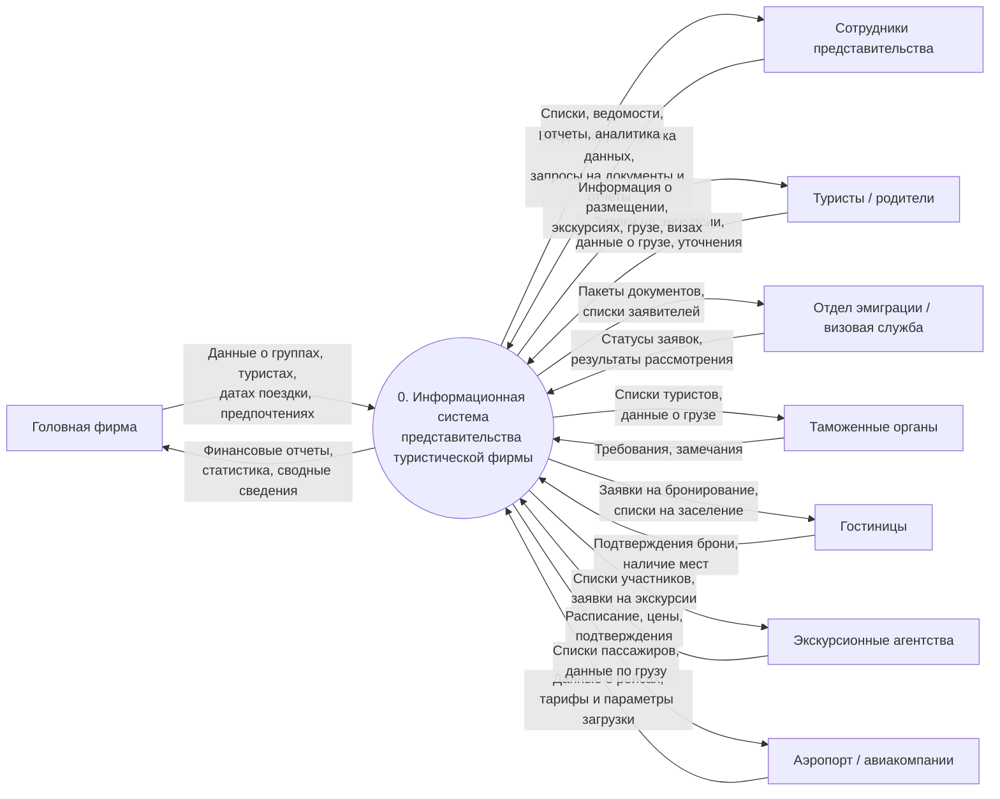

## Задание №1. Стейкхолдеры системы

### 1.1. Общая характеристика внешнего окружения

Внешнее окружение проектируемой системы образуют все лица и организации, которые:
- предоставляют данные для работы системы;
- используют данные, формируемые системой;
- влияют на требования, сроки, бюджет и порядок эксплуатации;
- зависят от качества работы системы.

Стейкхолдеров удобно разделить на **внутренних** и **внешних**.

---

### 1.2. Внутренние стейкхолдеры

| Стейкхолдер | Интерес к системе | Цели | Влияние на проект | Возможные риски |
|---|---|---|---|---|
| **Руководство головной туристической фирмы** | Получение полной и достоверной информации о группах, расходах, доходах и эффективности представительства | Контроль работы представительства, снижение издержек, повышение качества обслуживания, получение отчетности | **Высокое** — определяет цели проекта, бюджет, состав отчетов | Частая смена требований, расширение функционала без пересмотра сроков, недостаточное финансирование |
| **Руководитель зарубежного представительства** | Оперативное управление всеми процессами: визы, гостиницы, аэропорт, экскурсии, склад, финансы | Повышение управляемости, уменьшение ошибок, ускорение обслуживания туристов | **Высокое** — задает бизнес-правила и приоритеты автоматизации | Неполное формализованное описание процессов, изменение внутренних регламентов по ходу проекта |
| **Операторы/менеджеры представительства** | Удобный ввод и поиск данных, быстрый выпуск списков, документов и справок | Снижение ручной работы, устранение дублирования, уменьшение ошибок | **Среднее** — дают требования к интерфейсу и ежедневным операциям | Сопротивление внедрению, ошибки ввода, несоблюдение единых правил работы |
| **Визовый специалист** | Автоматизация подготовки пакета документов на визу и контроль статусов | Быстрое оформление документов, снижение числа отказов из-за ошибок | **Среднее** | Неполные данные от головной фирмы, нарушение сроков подачи, расхождения в документах |
| **Менеджер по гостиницам и расселению** | Учет предпочтений туристов, бронирований, списков на заселение | Своевременное расселение, контроль загрузки гостиниц | **Среднее** | Ошибки бронирования, овербукинг, несоответствие заявленных и фактических данных |
| **Менеджер по экскурсиям** | Формирование расписания экскурсий, запись туристов, передача списков агентствам | Повышение качества сервиса и учет спроса на экскурсии | **Среднее** | Ошибки в списках, отмены экскурсий, отсутствие актуальной информации от агентств |
| **Сотрудник склада** | Учет груза, маркировки, веса, упаковки, страховки и отправки | Исключение потерь и путаницы, прозрачность грузовых операций | **Среднее** | Неправильная маркировка, расхождения по весу, ошибки в ведомостях |
| **Бухгалтер/финансист представительства** | Учет всех доходов и расходов по статьям, группам и категориям туристов | Формирование точной отчетности и расчет рентабельности | **Высокое** | Несвоевременное внесение операций, ошибки распределения расходов, несогласованность с первичными документами |
| **Системный администратор / IT-специалист** | Стабильность, безопасность и сопровождаемость системы | Поддержка бесперебойной работы, резервное копирование, разграничение доступа | **Среднее** | Потеря данных, сбои, недостаточная защита персональных данных |

---

### 1.3. Внешние стейкхолдеры

| Стейкхолдер | Интерес к системе | Цели | Влияние на проект | Возможные риски |
|---|---|---|---|---|
| **Туристы-отдыхающие** | Качественное обслуживание, расселение, участие в экскурсиях | Получение комфортного сервиса и достоверной информации | **Среднее** | Жалобы из-за ошибок в бронировании, неверных данных по экскурсиям или визам |
| **Туристы shop-туров** | Оперативное обслуживание на складе, корректный учет и отправка груза | Безошибочный учет мест, веса, стоимости упаковки и страховки | **Среднее** | Претензии из-за потери груза, ошибок в маркировке, неверного расчета стоимости |
| **Родители и дети** | Безопасность, корректное сопровождение детей, соблюдение ограничений | Исключить самостоятельное перемещение ребенка без сопровождения, обеспечить корректное оформление документов | **Среднее** | Нарушение правил сопровождения детей, ошибки в связях “ребенок–родитель”, юридические претензии |
| **Отдел эмиграции / визовая служба** | Получение полного и корректного комплекта визовых документов | Соблюдение правил въезда и миграционного учета | **Высокое** | Отказы в визах, задержки оформления, несоответствие документов требованиям |
| **Таможенные органы** | Корректные списки туристов и сведения о грузе | Соблюдение законодательства и контроль перевозимых грузов | **Высокое** | Задержки на таможне, штрафы, проблемы из-за расхождений в документах |
| **Гостиницы** | Получение достоверных заявок на размещение, списков на заселение и оплату | Эффективное планирование загрузки номерного фонда | **Среднее** | Овербукинг, отказ в размещении, ошибки в списках и датах проживания |
| **Экскурсионные агентства** | Своевременное получение списков туристов, дат, количества участников и оплаты | Планирование экскурсий и качественное обслуживание групп | **Среднее** | Отмена экскурсий, ошибки в списках участников, снижение качества услуг |
| **Авиакомпании и аэропортовые службы** | Корректные данные по рейсам, числу пассажиров, весу и объему груза | Правильное планирование загрузки и расчетов за обслуживание | **Высокое** | Ошибки в загрузке, проблемы при отправке груза, некорректные расчеты за аэропортовые услуги |
| **Контролирующие органы и регуляторы** | Соблюдение законодательства, в том числе в части персональных данных и финансового учета | Законность деятельности представительства | **Высокое** | Штрафы, блокировка отдельных процессов, претензии по хранению и обработке персональных данных |

---

### 1.4. Ключевые стейкхолдеры

Наибольшее влияние на проект оказывают:

- руководство головной фирмы;
- руководитель представительства;
- бухгалтер/финансист;
- отдел эмиграции;
- таможенные органы;
- авиакомпании и аэропортовые службы.

Именно их требования критичны для определения состава функций, отчетов и ограничений системы.

---

## Задание №2. Границы системы

### 2.1. Определение границ

Граница проектируемой системы проходит по контуру **информационной поддержки деятельности зарубежного представительства**.  
Внутри границы находятся процессы **учета, хранения, обработки данных, формирования документов, отчетов и аналитики**.  
За пределами границы остаются процессы, где система не принимает решение сама, а только фиксирует результаты или передает данные внешним участникам.

---

### 2.2. Что входит в систему

В информационную систему входят следующие функции:

1. **Учет туристов и туристических групп**
   - регистрация групп;
   - учет состава группы;
   - хранение персональных и паспортных данных;
   - учет категорий туристов: отдыхающие, shop-туристы, дети;
   - учет связей “ребенок–родитель/сопровождающий”.

2. **Визовый учет**
   - формирование пакета документов на визу;
   - хранение статусов визовых заявок;
   - учет выданных виз;
   - контроль сроков и результатов оформления.

3. **Учет рейсов и движения групп**
   - фиксация дат прилета и вылета;
   - привязка групп к рейсам;
   - формирование списков для аэропорта и таможни.

4. **Учет гостиниц и расселения**
   - ведение справочника гостиниц;
   - хранение предпочтений туристов;
   - учет бронирований;
   - формирование списков на заселение;
   - учет фактического размещения по гостиницам и номерам.

5. **Экскурсионное обслуживание**
   - ведение перечня экскурсий;
   - учет экскурсионных агентств;
   - формирование расписания;
   - запись туристов на экскурсии;
   - передача списков участников агентствам;
   - учет оценок и качества экскурсионного обслуживания.

6. **Складской учет и отправка груза**
   - ведение весовых ведомостей;
   - учет маркировки;
   - учет количества мест, фактического и объемного веса;
   - учет упаковки и страхования;
   - формирование грузовых ведомостей;
   - привязка отправки груза к рейсу.

7. **Финансовый учет**
   - регистрация доходов и расходов;
   - учет статей затрат и доходов;
   - привязка финансовых операций к группе, туристу, рейсу, гостинице, экскурсии или грузу;
   - формирование сводного финансового отчета;
   - анализ доходности и рентабельности.

8. **Отчетность и аналитика**
   - списки для таможни;
   - списки на расселение;
   - статистика по туристам за период;
   - история поездок туриста;
   - статистика по гостиницам;
   - анализ популярности экскурсий;
   - анализ качества агентств;
   - статистика по грузообороту;
   - анализ загрузки рейсов;
   - расчет рентабельности представительства.

9. **Сервисные функции**
   - разграничение прав доступа;
   - журналирование действий пользователей;
   - поиск и фильтрация данных;
   - экспорт отчетов.

---

### 2.3. Что не входит в систему

За пределами системы остаются следующие процессы:

1. **Продажа туров в России** и взаимодействие с клиентами на этапе выбора тура.
2. **Маркетинг и реклама** туристической фирмы.
3. **Оформление загранпаспортов** и иных документов вне деятельности представительства.
4. **Принятие решения о выдаче визы** — это функция государственных органов, а не системы.
5. **Фактическое прохождение таможенного и миграционного контроля**.
6. **Управление внутренней работой гостиницы**:
   - уборка;
   - обслуживание номеров;
   - внутренний гостиничный биллинг;
   - работа стойки регистрации как отдельной системы.
7. **Непосредственное проведение экскурсий** экскурсионными агентствами.
8. **Физическое выполнение складских операций**:
   - упаковка;
   - взвешивание;
   - погрузка/разгрузка;
   - хранение;
   система только фиксирует их результаты.
9. **Управление самолетами, рейсами и аэропортовой инфраструктурой**.
10. **Банковский эквайринг и проведение платежей** как банковская операция; в системе фиксируются только факты расчетов.
11. **Кадровый учет и расчет заработной платы сотрудников представительства**, если это не включено отдельным требованием.
12. **Юридическое сопровождение споров и претензионная работа**, кроме хранения информации о фактах.

---

### 2.4. Внешние системы, взаимодействующие с проектируемой системой

| Внешняя система | Характер взаимодействия | Основные данные обмена |
|---|---|---|
| **Информационная система головной фирмы** | Передача исходных данных по группам и получение отчетности | состав группы, данные туристов, предпочтения по гостиницам, финансовые отчеты, статистика |
| **Система визового/эмиграционного ведомства** | Передача визовых данных и получение статусов | анкеты, пакеты документов, номера виз, статусы рассмотрения |
| **Системы гостиниц или гостиничные PMS/booking-системы** | Передача заявок и получение подтверждений | брони, списки на заселение, наличие мест, подтверждение проживания |
| **Системы аэропорта / авиакомпаний** | Обмен сведениями по рейсам и грузу | данные рейсов, загрузка самолета, вес и объемный вес груза, аэропортовые услуги |
| **Системы таможенных органов** | Передача регламентированных списков и грузовых сведений | списки туристов, сведения о перевозимом грузе |
| **Системы экскурсионных агентств** | Передача заявок на экскурсии и получение расписаний/подтверждений | списки участников, даты, стоимость, оценки качества |
| **Внешние бухгалтерские/банковские сервисы** | При необходимости — передача финансовых данных | суммы, платежные документы, курсы валют, реквизиты |

> На практике взаимодействие может быть как автоматическим через API, так и полуавтоматическим: через Excel, PDF, e-mail или ручной ввод оператором.

---

### 2.5. Какие процессы можно и нужно автоматизировать

Ниже приведены процессы, которые целесообразно автоматизировать в первую очередь.

| Процесс | Степень автоматизации | Обоснование |
|---|---|---|
| Импорт и регистрация данных о группах и туристах | Полная/частичная | Позволяет сократить ручной ввод и дублирование |
| Проверка полноты данных и контроль обязательных реквизитов | Полная | Снижает число ошибок в визах, бронировании и отчетах |
| Формирование пакета документов на визу | Полная | Ускоряет оформление и уменьшает число неточностей |
| Учет статусов визовых заявок | Полная | Позволяет контролировать готовность документов |
| Формирование списков для таможни | Полная | Регламентированный и повторяющийся процесс |
| Бронирование и учет расселения по гостиницам | Полная/частичная | Автоматизация списков и учета необходима, подтверждение гостиницы может быть внешним |
| Учет экскурсий и запись туристов | Полная | Позволяет быстро получать состав участников и популярность экскурсий |
| Формирование списков для экскурсионных агентств | Полная | Типовой документный обмен |
| Учет груза, маркировки, веса и стоимости услуг | Полная/частичная | Документооборот автоматизируется полностью, физические операции выполняются людьми |
| Формирование грузовых ведомостей и данных по отправке | Полная | Требует точности и повторяемости |
| Учет финансовых операций и статей | Полная | Критически важно для отчетности и контроля рентабельности |
| Формирование финансового отчета по группе, категории и периоду | Полная | Основное управленческое требование |
| Аналитические запросы и статистика | Полная | Позволяет принимать управленческие решения на основе данных |

### 2.6. Процессы, которые автоматизируются только частично

Есть процессы, где система может лишь сопровождать деятельность, но не заменить человека:

- принятие решения о выдаче визы;
- физический прием и упаковка груза;
- фактическое размещение туристов в гостиницах;
- проведение экскурсии;
- сопровождение группы в аэропорту;
- прохождение туристами таможни и миграционного контроля.

Для таких процессов система выполняет функции:
- учета;
- фиксации результата;
- документального сопровождения;
- контроля сроков и статусов.

---

## Задание №3. Контекстная диаграмма (DFD уровень 0)

### 3.1. Контекст системы

На уровне DFD 0 вся проектируемая система рассматривается как **один процесс**:

**Процесс 0 — “Информационная система представительства туристической фирмы”**

Внешними сущностями по отношению к этому процессу являются:
- головная фирма;
- сотрудники представительства;
- туристы / родители;
- отдел эмиграции / визовая служба;
- таможенные органы;
- гостиницы;
- экскурсионные агентства;
- аэропорт / авиакомпании.

---

### 3.2. Внешние акторы и потоки данных

| Внешний актор | Потоки данных в систему | Потоки данных из системы |
|---|---|---|
| **Головная фирма** | данные о группах, туристах, датах поездки, предпочтениях по гостиницам | финансовые отчеты, статистика, сведения о размещении, визах, экскурсиях и грузах |
| **Сотрудники представительства** | ввод и корректировка данных, запросы на формирование документов и отчетов | рабочие списки, отчеты, ведомости, уведомления, аналитика |
| **Туристы / родители** | заявки на экскурсии, сведения о грузе, уточнение персональных данных | информация о гостинице, экскурсиях, грузе, визовом статусе |
| **Отдел эмиграции / визовая служба** | требования к документам, результаты рассмотрения, статусы виз | пакеты документов на визу, списки заявителей |
| **Таможенные органы** | замечания, требования к спискам и грузовым данным | списки туристов, сведения о грузе |
| **Гостиницы** | подтверждения брони, сведения о наличии мест, условия проживания | заявки на бронирование, списки на заселение |
| **Экскурсионные агентства** | расписание, цены, подтверждения, сведения о проведении экскурсий | списки участников экскурсий, заявки на обслуживание |
| **Аэропорт / авиакомпании** | сведения о рейсах, тарифы и данные по обслуживанию, параметры загрузки | списки пассажиров, данные по грузу, заявки на отправку |

---

### 3.3. Контекстная диаграмма в виде схемы

